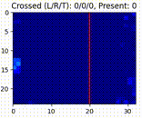
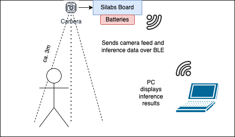
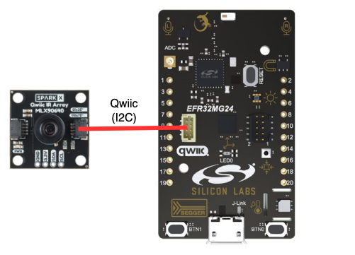
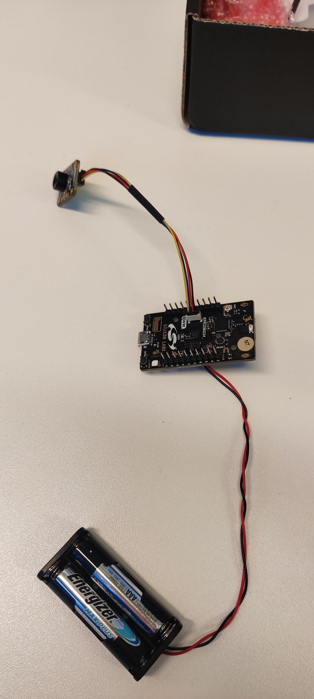
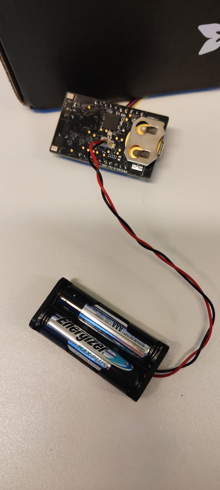
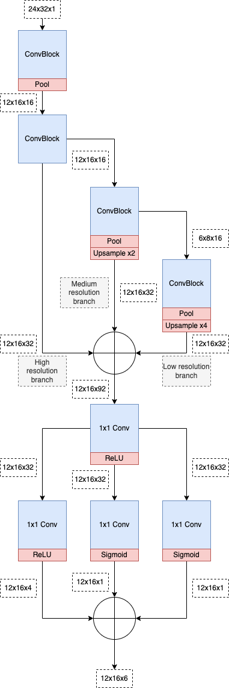

# IR People Flow Counter
**This example is for demonstration purposes ONLY, and should not be considered a production ready solution. The purpose of this example is to show technical viability, or proof of concept**

This example leverages deep learning to detect objects with a low resolution IR camera -people in this case- and determine bounding boxes around objects. It also tracks the people's movement and can be used for detecting motion flows:

<p align="center">

</p>

The above video is an example of the output that this demo provides. The output is the raw camera feed overlaid with the inference results, all being produced by the board. The inference result are the bounding boxes (in red), from which one can derive centroids (white dots), that can then be tracked from frame to frame (white arrows).

The title shows information about people crossing the red line:
<ul> 
    <li> <b>L</b> and <b>R</b> is the number of people that have crossed from right to left and vice versa respectively. </li>
    <li> <b>T</b> is the number of people that have crossed from left to right, and not yet crossed back. </li>
    <li> <b>Present</b> is the number of people (number of bounding boxes) currently detected by the model on the full image.</li>
</ul>

The main benefit of using deep learning to solve this problem is the ability to separate people that are close together, and in general separate objects that have overlapping IR signatures. This example also includes a way to gather new data, which is recommended to achieve improved robustness and reduce the likelihood of false positives.

*The model training data is available upon request.*
### Setup

The following hardware is needed:
* MLX90640 110 Deg IR camera ([link](https://www.adafruit.com/product/4469)).
* Devkit xG24-DK2601B ([link](https://www.silabs.com/development-tools/wireless/efr32xg24-dev-kit?tab=overview)). Referred to as "the device".
* A way to power the device, needs to supply up to 30mA @ 3.3v. Some  options:
  * 2x AAA batteries in series connected to the Hirose DF13C-2P connector on the back of the xG24 devkit. 
  * Using the USB connector in combination with a power source such as a power bank or laptop.
  
The demo is intended to be set up like this:
<p align="center">

</p>
<p align="center">

</p>

Considerations:
* The model is trained on data that was gathered at a height of approx. 3 meters, and therefore the demo should be set up at a similar height.

An example setup using 2x AAA batteries looks like this:

<p align="center">


</p>

### Building and Flashing
One can simply open this repo as a project in [Simplicity Studio](https://www.silabs.com/developers/simplicity-studio) and it will handle building and flashing. Alternative is to do it all manually:

First step is to clone this repo, and then generate the project definitions:
```sh
slc generate -s <path-to-gecko-sdk> -p people_flow_counter_mlx90640.slcp -d .<board-name> --with <board-name>
```
`<board-name>` in this case would be `brd2601b`.

Next step is to build the project:
```sh
cd .<board-name>
make -f people_flow_counter_mlx90640.Makefile -j4
```
Final step is to flash the board, assuming the working directory is still `.<board-name>`:
```sh
commander flash "build/debug/people_flow_counter_mlx90640.s37"
```
### Connecting with Bluetooth Low Energy (BLE)
*Due to the limitations of `bleak`, a python library for BLE, there might be some instabilities depending on the OS. It has been tested on both Windows and Mac OS, and proven to work out of the box, but with some instabilities. "Forgetting" the device can sometimes help.* 

The first step is to launch the BLE server on the PC by going into the `misc` folder and running:
```sh
python display_serial_ble_server.py
```
This will boot up a server which lets you connect to the device. The device is named `IR Device`.  **Make sure the device is disconnected from the PC, otherwise it will not be found by the server.** If it crashes, just retry.

The dependencies for the python script can be installed with the following command:
```sh
pip install -r requirements.txt
```


Once the server is connected, it is possible to observe the system in action by going into the `misc` folder and running:
```sh
python display_serial_ble.py
```
A window should pop up showing the camera feed with the predictions.
### Displaying over serial
Displaying over serial may be useful for debugging because it is simpler and faster.


Before proceeding, the baudrate of the board needs to be reconfigured. Follow [this guide](https://community.silabs.com/s/article/wstk-virtual-com-port-baudrate-setting?language=en_US) on how to do it. The target baudrate is `921600`.

By default the program uses BLE as its output, but by setting the `OUTPUT_OVER_BLE` define near the top of `people_counting.cc` file to `false` it will use serial instead.

After rebuilding and flashing, one can observe the system in action by going into the `misc` folder and running:
```sh
python display_serial_local.py
```
A window should pop up showing the camera feed with the predictions.
### Notes
The display python scripts accept other useful arguments that can be listed by executing the script with `-h` appended. Features such as data gathering and video recording may be enabled this way.

## Technical Details
### Performance
The table below displays performance numbers for the application, divided into separate processes. When running as a demo, with raw camera feed output (referred to as debug), the application is significantly slower than if it was running as a potentially finished product only outputting data about people flow and count. The BLE measurements are slightly inaccurate due to the implementation prioritizing throughput rather than latency.

Values in **bold** are what one would expect in production. 

| Operation                         | ms      | FPS      |
| --------------------------------- | ------- | -------- |
| Camera                            | 78      | -        |
| Preprocessing                     | 1       | -        |
| Inference                         | 35      | -        |
| Postprocessing                    | 1       | -        |
| Export results (Serial)           | 1       | -        |
| Export results (BLE)              | 12      | -        |
| Export debug information (Serial) | 33      | -        |
| Export debug information (BLE)    | 132     | -        |
| Total + Debug (Serial)            | 148     | 6.75     |
| Total + Debug (BLE)               | 262     | 3.81     |
| **Total (Serial)**                | **115** | **8.69** |
| **Total (BLE)**                   | **130** | **7.69** |

As for energy consumption, the camera uses the most energy as can be seen in the following table:

| Component                        | mA        |
| -------------------------------- | --------- |
| Camera                           | 20        |
| Board (during inference, serial) | 4.51      |
| Board (during inference, BLE)    | 6.50      |
| **Total (Serial)**               | **24.51** |
| **Total (BLE)**                  | **26.50** |

### Model Architecture
The model is based on concepts from [this paper](https://arxiv.org/abs/2006.09214). The architecture itself is different from the paper, has only **11238 parameters**, and can be described using this simplified diagram:
<p align="center">

</p>

It has three resolution branches that has the purpose of viewing the input in multiple dimensions. This is done so that the model hopefully learns to capture differently sized structures in the respective branches.

### Deploying a model to the device

Deploying a model is simple, and can be summarized in 4 steps:
1. Train model using Tensorflow
2. Quantize the model (Optional, but highly recommended)
3. Replace the `.tflite` model file in the `config/tflite/` folder
4. Re-generate, re-build, and re-flash the device
  
**Below is more detailed version:**

 Assuming a model has been trained in Tensorflow, the first step is to quantize it. This can be done with the following code snippet:

```python
# Convert the model to the TensorFlow Lite format
converter = tf.lite.TFLiteConverter.from_keras_model(model)
tflite_model = converter.convert()
open("model.tflite", "wb").write(tflite_model)

# Convert the model to the TensorFlow Lite format with quantization
converter = tf.lite.TFLiteConverter.from_keras_model(model)
converter.optimizations = [tf.lite.Optimize.DEFAULT]

converter.representative_dataset = representative_dataset

tflite_model = converter.convert()

# Save the model to disk
open("model_quantized.tflite", "wb").write(tflite_model)

basic_model_size = os.path.getsize("model.tflite")
print(f"Basic model is {basic_model_size} bytes")
quantized_model_size = os.path.getsize("model_quantized.tflite")
print(f"Quantized model is { quantized_model_size} bytes")
difference = basic_model_size - quantized_model_size
print(f"Difference is { difference} bytes")
```
The representative dataset is a generator function used by the quantization algorithm. It provides samples with the aim of roughly representing the data distribution, more info [here](https://www.tensorflow.org/api_docs/python/tf/lite/RepresentativeDataset).

Once a quantized `.tflite` file has been produced, it can be dragged into the `config/tflite/` folder to replace the existing model. The final step is to re-generate, re-build, and re-flash the device. 

The new model is now deployed on the device.