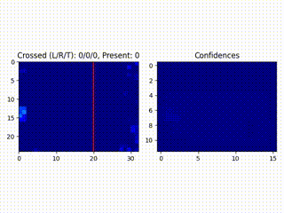

# IR People Flow Counter
This application leverages deep learning to detect people and determine their bounding boxes using an IR camera. It also tracks the peoples movement and can be used for detecting flows:



## Setup
The following hardware is needed:
* MLX90640 110 Deg IR camera
* EFR32MG24 board with AI acceleration
* Raspberry Pi with WiFi (Needed for demo purposes, such as hanging it up on a roof)

First step is to generate the project definitions:
```sh
slc generate -s <path-to-gecko-sdk> -p people_flow_counter_mlx90640.slcp -d .<board-name> --with <board-name>
```
Next step is to build the project:
```sh
cd .<board-name>
make -f people_flow_counter_mlx90640.Makefile -j4
```
Final step is to flash the board, assuming the working directory is still `.<board-name>`:
```sh
commander flash "build/debug/people_flow_counter_mlx90640.bin" --address 0x08000000
```
It is now possible to observe the system in action by going into the `misc` folder and running:
```sh
python display_serial_local.py
```
A window should pop up showing the camera feed with the predictions. You can install the dependencies for the python script with the following command:
```sh
pip install -r requirements.txt
```
### Setting up Raspberry Pi
The goal here is to have the system connected to a Raspberry Pi hanging on the roof, and that way send the information from the board to a PC that you can connect remotely to the Pi.

A recommended OS to use is the Raspberry Pi OS Lite, which can be found [here](https://www.raspberrypi.com/software/operating-systems/). Otherwise, any OS should do. 

The first step is to configure the Raspberry Pi to act as a WiFi router (internet access not required), there are numerous guides on how to do this online so just follow those. This will allow a PC to connect to the Raspberry Pi through WiFi.

Once this is done, and the PC is connected to the Raspberry Pi WiFi endpoint, it should be possible to gain remote access to the Raspberry Pi through `ssh`.

The next step is to link the serial port of the Raspberry Pi with a TCP socket. This can be done using a utility called `socat`, which can be installed on the Pi with:
```sh
sudo apt install socat
```
A link can be set up with the following command on the Pi:
```sh
sudo socat -u <serial-interface>,raw,echo=0 TCP-LISTEN:<port>,reuseaddr
```
where `<serial-interface>` is the serial interface, on the recommended Pi OS it is usually `ACM0`. While `<port>` is just the desired port number and can be anything, one example is `62000`.

Now that the link is set up, it is possible to display the camera results and predictions on the PC using:
```sh
sudo python display_serial_remote.py --address <ip>:<port>
```
Where `<ip>` is the ip of the Raspberry Pi, usually on the form `192.168.x.x`, and `<port>` is the port that was provided to the `socat` command. You can install the dependencies for the python script with the following command:
```sh
pip install -r requirements.txt
```

## Notes
The display python script accepts other useful arguments that can be listed by executing the script with `-h` appended. 

There is sometimes an issue when connecting remotely multiple times, the solution is often to either restart the `socat` command or reconnect to the Pi WiFi endpoint.
